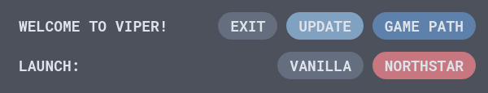

## What is Viper?

Viper is a launcher and updater for [Northstar](https://github.com/R2Northstar/Northstar), and not much more than that.

<p align="center">
  
</p>

## How to?

Currently Viper isn't in a state where I dont have release builds ready for people to download, instead if you really do wanna play with it, you can run it with Node... Simply do as follows:

```sh
$ git clone https://github.com/0neGal/viper

$ cd viper

$ npm i

$ node_modules/.bin/electron src/index.js
```

This'll launch it with the Electron build installed by `npm`. You can also use `npm start` on Linux, for some reason this is broken on Windows, I don't know why.

## What can it do specifically?

Currently Viper is capable of:

 * Updating/Installing Northstar
 * Launching Vanilla and or Northstar
 * Be pretty!

Besides this I've been considering adding some easy to use VPK modding tools so everybody can have fun with VPK modding even if you don't know how to do it the traditional way. However that is not at the top of the todo list right now.
