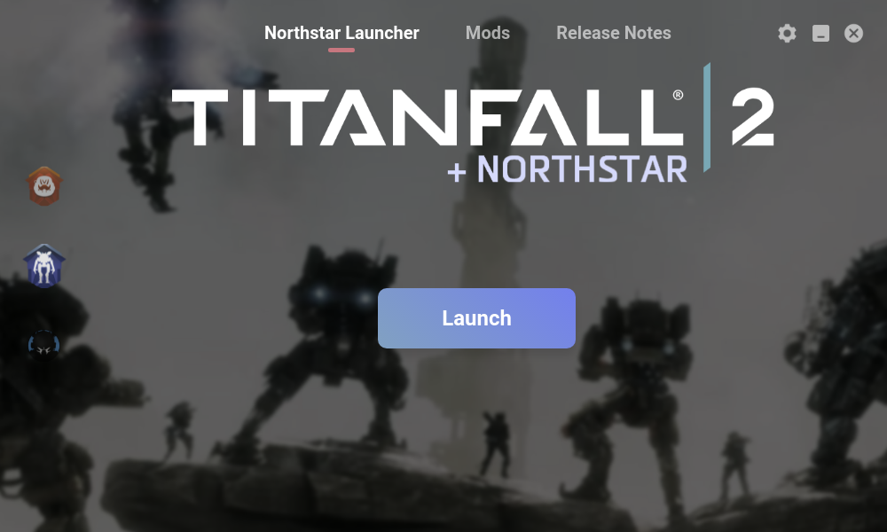

<p align="center">
	<br>
	<a href="https://0negal.github.io/viper/index.html?win-setup"></a><br>
	<a href="FAQ.md">FAQ</a> | 
	<a href="CONTRIBUTING.md">Contributing</a> | 
	<a href="https://github.com/0neGal/viper/releases">Releases</a><br>
</p>

## What is Viper?

Viper is a launcher and updater for [Northstar](https://github.com/R2Northstar/Northstar), and not much more than that.

## Install

Downloads are available on the [releases page](https://github.com/0neGal/viper/releases/latest). 

Please note that some versions will update themselves automatically when a new release is available (just like Origin or Steam) and some will NOT, so choose it accordingly. Only the AppImage, Flatpak and Windows Setup/Installer can auto-update.

**Windows:** [`Viper Setup [x.y.z].exe`](https://0negal.github.io/viper/index.html?win-setup) (auto-updates, and is recommanded), [`Viper [x.y.z].exe`](https://0negal.github.io/viper/index.html?win-portable) (single executable, no fuss)

**Linux:** [`.AppImage`](https://0negal.github.io/viper/index.html?appimage) or [Flatpak](https://flathub.org/apps/details/com.github._0negal.Viper) (auto-updates), [AUR (unofficial)](https://aur.archlinux.org/packages/viper-bin), [`.deb`](https://0negal.github.io/viper/index.html?deb), [`.rpm`](https://0negal.github.io/viper/index.html?rpm), [`.tar.gz`](https://0negal.github.io/viper/index.html?linux)

<a href="https://github.com/0neGal/viper/releases"></a>


## What can it do specifically?

<p>
Currently Viper is capable of:



 * Updating/Installing Northstar
 * Launching Vanilla and or Northstar
 * Manage Mods
 * Auto-Update itself 
 * Be pretty!

There are of course many other things that it can do, but summed up very simply, that is what Viper is capable of doing. With every update Viper gets more features and alike, often many optional features are also available in the settings menu.

</p>

## Configuration

All settings take place in the settings page, found in the top right corner of the app, where you can change all kinds of settings. You can also manually go in and edit your config file (`viper.json`), if you feel so inclined.

Your configuration file will be found in `%APPDATA%\viper.json` on Windows, and inside either `~/.config` or through your environment variables (`$XDG_CONFIG_HOME`) on Linux, the latter has priority.

## Support

To get support please [open a GitHub issue](https://github.com/0neGal/viper/issues/new/choose), and clearly describe the problem with as many details as possible.

### Frequently Asked Questions (FAQ)

Many of the questions and problems you may have might be able to be answered by reading the [FAQ page](FAQ.md). So before opening an issue or asking for support please read through it first!

## Sidenote

Given that we already have so many Northstar updaters and launchers I urge people to instead of creating new launchers unless there's a very specific reason, just make a pull request on one of the existing ones, otherwise we'll continue to have new ones.

<p align="center">
	Relevant xkcd:<br>
	
</p>

Some of the existing launchers are listed below:
 * Viper - A launcher, updater and mod manager with an easy to use GUI
 * [FlightCore](https://github.com/R2NorthstarTools/FlightCore) - A more minimal GUI manager and updater, with similar features to Viper
 * [ViperSH](https://github.com/0neGal/viper-sh) - A Bourne Shell, CLI only, Northstar updater and mod manager
 * [VTOL](https://github.com/BigSpice/VTOL) - an updater and manager for mods, very feature rich
 * [r2modman](https://github.com/ebkr/r2modmanPlus) - General purpose mod manager, which has support for Northstar
 * [Papa](https://github.com/AnActualEmerald/papa) - a CLI only installer, updater, and mod manager
 * [FIITE](https://github.com/EladNLG/FastestInstallerInTheEast) - a minimalistic CLI installer and updater.

## Development

If you wanna edit Viper's code, run it, and so on, you can simply do something along the lines of the below:

```sh
$ git clone https://github.com/0neGal/viper

$ cd viper

$ npm i

$ npm run start
```

This'll launch it with the Electron build installed by `npm`.

Additionally, if you're creating your own fork you easily publish builds and or make builds with either `npm run publish` or `npm run build` respectively, the prior requiring a `$GH_TOKEN` to be set, as it creates the release itself so it needs a token with access to your repo. So you'd do something along the lines of:

```sh
$ GH_TOKEN="<your very long, private and wonderful token>" npm run publish
```

Keep in mind building all Linux builds may take a while on some systems, as packaging the `tar.gz` release can take a while on many CPUs, at least from my testing. All other builds should be done quickly. When using the `publish` command it also automatically uploads the needed files to deploy auto-updates, keep in mind you'd need to have the `repository` setting changed to your new fork's location, otherwise it'll fetch from the original.

## Credits

<a href="https://github.com/0neGal/viper/graphs/contributors">
	
</a>

**Logo:** Imply#9781<br>
**Viper Background:** [Uber Panzerhund](https://www.reddit.com/r/titanfall/comments/fwuh2x/take_to_the_skies)<br>
**Titanfall+Northstar Logo:** [Aftonstjarma](https://www.steamgriddb.com/logo/47851)
